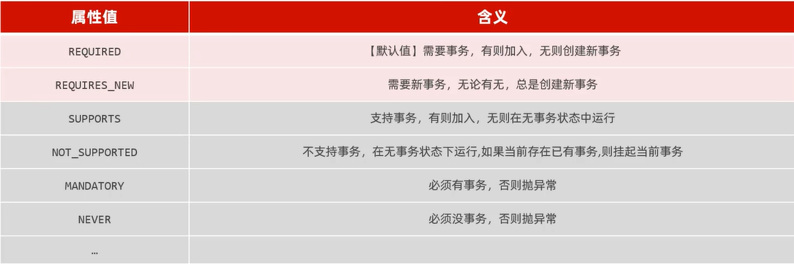
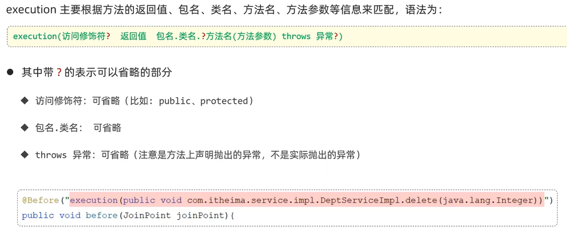

## 事务管理和AOP

### 1事务管理

#### 	1事物回顾

​	定义：一组操作的集合，不可分割的工作单位；

​	操作：1开启事务(操作开始前)start transaction /begin

​		    2提交事务(操作全部完成后提交)commit

​		    3回滚事务(操作时有异常，回滚)rollback

#### 	2Spring事物处理

```java
//小案例：解散部门；(删除部门-并且删除部门下的员工)

​	//若在删除时出现异常，部门删除成功而员工还未删除
@Override
    public void delete(Integer id) {

        deptMapper.delete(id);//删除部门

        empMapper.deleteByDeptId(id);//删除此部门内员工
    }
```

​	关于@Transactional注解

​	位置：业务service层的方法、类、接口上；

​	作用：将当前方法交给spring进行事务管理；方法执行前开启事务，执行完毕提交事务，出现异常回滚事务(一般在多步增删改)

```properties
#开启Spring事务管理日志
logging.level.org.springframework.jdbc.support.JdbcTransactionManager= debug
```

#### 	3事务进阶

​	有关rollbackFor，默认只有出现Runtime Exception才会回滚，rollbackFor属性用于控制出现何种异常类型，进行回滚事务

​	(事务的传播行为，指一个事务方法被另一个事务方法调用时，这个事务应该如何进行事务控制)有关propagation，



​		具体了解REQUIRED、REQUIRES_NEW

```java
//案例-解散部门-记录日志
	//1删除部门、下面员工；2记录日志到数据库表中

```

​	由于日志需要记录所有情况，应将insert插入日志操作作为一个新的事务，这样就算是业务方法因为错误回滚也不会影响日志插入操作事务commit

```java
@Service
public class DeptLogServiceImpl implements DeptLogService {

    @Autowired
    private DeptLogMapper deptLogMapper;

    @Transactional(propagation = Propagation.REQUIRES_NEW)
    @Override
    public void insert(DeptLog deptLog) {
        deptLogMapper.insert(deptLog);
    }
}
```

```java
@Transactional(rollbackFor = Exception.class)
    @Override
    public void delete(Integer id) throws Exception {
        try {
            deptMapper.delete(id);//删除部门
//        int i = 1/0;
            if (true)throw new Exception("出错了....");
            empMapper.deleteByDeptId(id);//删除部门下员工
        } finally {
            DeptLog deptLog = new DeptLog();
            deptLog.setCreateTime(LocalDateTime.now());
            deptLog.setDescription("执行了解散操作");
            deptLogService.insert(deptLog);
        }
    }
```


```java
2024-09-21 17:00:12.323 DEBUG 23664 --- [nio-8080-exec-1] o.s.jdbc.support.JdbcTransactionManager  : Initiating transaction commit
2024-09-21 17:00:12.325 DEBUG 23664 --- [nio-8080-exec-1] o.s.jdbc.support.JdbcTransactionManager  : Committing JDBC transaction on Connection [HikariProxyConnection@1270875261 wrapping com.mysql.cj.jdbc.ConnectionImpl@60c0c51f]
2024-09-21 17:00:12.329 DEBUG 23664 --- [nio-8080-exec-1] o.s.jdbc.support.JdbcTransactionManager  : Releasing JDBC Connection [HikariProxyConnection@1270875261 wrapping com.mysql.cj.jdbc.ConnectionImpl@60c0c51f] after transaction
2024-09-21 17:00:12.329 DEBUG 23664 --- [nio-8080-exec-1] o.s.jdbc.support.JdbcTransactionManager  : Resuming suspended transaction after completion of inner transaction
Transaction synchronization resuming SqlSession [org.apache.ibatis.session.defaults.DefaultSqlSession@25933952]
Transaction synchronization deregistering SqlSession [org.apache.ibatis.session.defaults.DefaultSqlSession@25933952]
Transaction synchronization closing SqlSession [org.apache.ibatis.session.defaults.DefaultSqlSession@25933952]
2024-09-21 17:00:12.330 DEBUG 23664 --- [nio-8080-exec-1] o.s.jdbc.support.JdbcTransactionManager  : Initiating transaction rollback
2024-09-21 17:00:12.330 DEBUG 23664 --- [nio-8080-exec-1] o.s.jdbc.support.JdbcTransactionManager  : Rolling back JDBC transaction on Connection [HikariProxyConnection@819996348 wrapping com.mysql.cj.jdbc.ConnectionImpl@424cd57c]
2024-09-21 17:00:12.332 DEBUG 23664 --- [nio-8080-exec-1] o.s.jdbc.support.JdbcTransactionManager  : Releasing JDBC Connection [HikariProxyConnection@819996348 wrapping com.mysql.cj.jdbc.ConnectionImpl@424cd57c] after transaction
afterCompletion ...
java.lang.Exception: 出错了....
```


### 2AOP基础

### 	1引子

​	Aspect Oriented Programming ：面向切面编程，即面向特定方法编程

​	场景：案例部分功能运行较慢，定位执行耗时较长的业务方法，此时需要统计每一个业务方法的执行耗时；

​	实现：动态代理是面向切面编程最主流的的实现，而SpringAOP是Spring框架的高级技术，旨在管理bean对象的过程中，主要通过底层代码的动态代理机制，对特定的方法进行编程；

#### 	2快速入门-案例统计各个业务层方法执行耗时

​	导入依赖：在pom文件导入AOP依赖；

```xml
<!--        AOP依赖-->
        <dependency>
            <groupId>org.springframework.boot</groupId>
            <artifactId>spring-boot-starter-aop</artifactId>
        </dependency>
```

​	编写AOP程序：针对于特定方法根据业务需要进行编程

```java
@Slf4j
@Component
@Aspect//声明AOP类
public class TimeAspect {

    @Around("execution(* com.itheima.service.*.*(..))")//切入点表达式
    
    public Object recordTime(ProceedingJoinPoint joinPoint) throws Throwable {
        //1 记录开始时间
        long begin = System.currentTimeMillis();

        //2 调用原始运行方法
        Object result = joinPoint.proceed();

        //3 记录结束时间
        long end  = System.currentTimeMillis();
        log.info(joinPoint.getSignature()+"方法执行耗时：{}",(end-begin));
        return result;
    }
}
```


​	使用场景：记录操作日志、权限控制、事务管理……

​	优势：代码无侵入、减少重复代码、提高开发效率、维护方便

#### 	3AOP核心概念

​	连接点：JoinPoint，可以被AOP控制的方法

​	通知：Advice，指那些重复的逻辑，也就是共性功能

​	切入点：PointCut，匹配连接点的条件

​	切面：Aspect，描述通知与切入点的对应关系(通知+切入点)

​	目标对象：Target，通知所应用的对象；

### 3AOP进阶

#### 	1通知类型

​	@Around：环绕通知，此注解标注的通知方法在目标方法前后都被执行

​	@Before：前置通知，在目标方法运行之前运行

​	@After：后置通知，一定会执行；

​	@AfterReturning：返回后通知，目标方法正常运行后通知被执行；有异常不执行

​	@AfterThrowing：异常后通知，目标方法异常后通知执行

#### 	2通知顺序

##### 	1一般顺序

​	有异常时顺序，@Around后半部分和@AfterReturning不会执行

```java
2024-09-21 19:38:23.273  INFO 7792 --- : around before ...
2024-09-21 19:38:23.274  INFO 7792 --- : before ...
2024-09-21 19:38:23.274  INFO 7792 --- : afterThrowing ...
2024-09-21 19:38:23.274  INFO 7792 --- : after ...
2024-09-21 19:38:23.292 ERROR 7792 --- [nio-8080-exec-3] o.a.c.c.C.[.[.[/].[dispatcherServlet]    : Servlet.service() for servlet [dispatcherServlet] in context with path [] threw exception [Request processing failed; nested exception is java.lang.ArithmeticException: / by zero] with root cause

```

​	无异常时顺序，除@AfterThrowing未执行，其他均正常执行

```java
2024-09-21 19:43:33.853  INFO 16020 --- : Initializing Servlet 'dispatcherServlet'
2024-09-21 19:43:33.853  INFO 16020 --- : Completed initialization in 0 ms
2024-09-21 19:43:33.890  INFO 16020 --- : around before ...
2024-09-21 19:43:33.890  INFO 16020 --- : before ...
Creating a new SqlSession

Closing non transactional SqlSession [org.apache.ibatis.session.defaults.DefaultSqlSession@4424d45e]
2024-09-21 19:43:34.310  INFO 16020 --- : afterReturning ...
2024-09-21 19:43:34.310  INFO 16020 --- : after ...
2024-09-21 19:43:34.310  INFO 16020 --- : around after ...
```

##### 	2复杂情况

​	当多个切面的切入点都匹配到了目标方法，目标方法运行时，多个通知方法都会被执行；

​	默认为字母顺序；也可以使用@Order(数字)指定执行顺序，数字越小越先执行

#### 	3切入点表达式

​	@Pointcut注解，可以复用的切点表达式；

```java
@Pointcut("execution(* com.itheima.service.impl.DeptServiceImpl.*(..))")
    public void pt(){}

    @Before("pt()")
    public void before(){
        log.info("before ...");
    }
```

​	作用：主要用来决定项目中的那些方法需要加入通知

​	常用形式：

##### 	1execution



##### 	2annotation注解

​	自定义注解，编写一个注解，加上两个注解，在需要切面的地方加上自定义注解

```java
@Pointcut("@annotation(com.itheima.aop.MyLog)")//全类名
    private void pt(){}

```

```java

import java.lang.annotation.ElementType;
import java.lang.annotation.Retention;
import java.lang.annotation.RetentionPolicy;
import java.lang.annotation.Target;

@Retention(RetentionPolicy.RUNTIME)
@Target(ElementType.METHOD)
public @interface MyLog {
}
```

#### 	4连接点

​	指方法的执行；在Spring中用JoinPoint抽象了连接点，可以获得方法执行是的相关信息；对于@Around通知，只能使用ProceedingJoinPoint；而其他四种通知只能使用JoinPoint，他是ProceedingJoinPoint的父类型

​	JoinPoint是org.aspect.lang包下的

### 4AOP案例

​	将案例中增删改查相关接口的操作日志记录到数据库表中；

​	日志信息包括：操作人，操作时间，执行方法的全类名，执行方法名，方法运行时参数，返回值，方法执行时长；